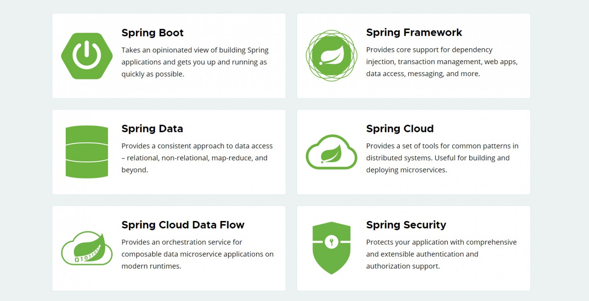
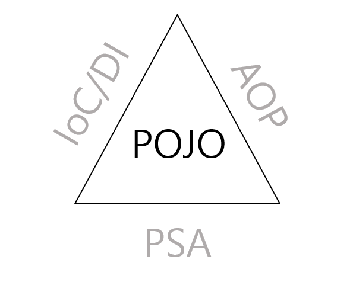
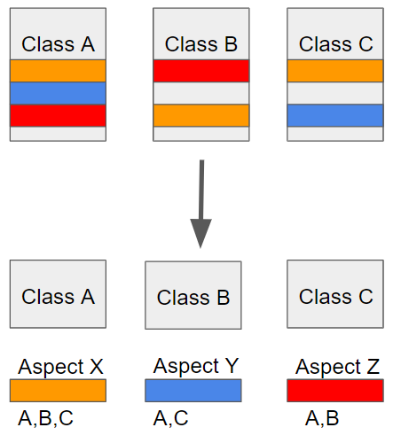
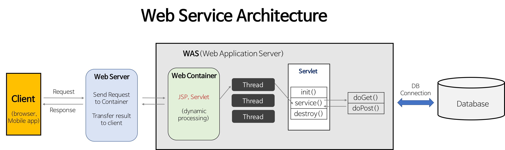

# 1️⃣ Spring

스프링은 객제 지향 언어가 가진 강력한 특징을 살려내는 프레임워크로 좋은 객체 지향 애플리케이션을 보다 쉽게 개발할 수 있게 도와주는 도구이다.

이는 **스프링 생태계**라고 하는 여러가지 기술들의 모임으로 이뤄져 있다.



> ### ❓그러면 Spring은 왜 만들어졌을까?
> 스프링(Spring)은 개발자가 보다 쉽게 객체 지향 원칙을 따르면서 개발할 수 있게 도와주도록 개발된 프레임워크 이다.

참고) 좋은 객체지향 원칙에 대한 내용은 [링크](https://mangkyu.tistory.com/386)를 참조하자.


## Spring이 지원하는 기술들

프레임워크는 애플리케이션을 구성하는 오브젝트가 생성되고 동작하는 방식에 대한 틀을 제공해줄 뿐만 아니라, 어떻게 작성돼야 하는지에 대한 기준도 제시해준다. 
이런 틀을 보통 **프로그래밍 모델**이라고 한다. 
스프링은 IoC/DI, AOP, PSA 이렇게 세가지 핵심 프로그래밍 모델을 지원한다.



위의 그림을 보면 IoC/DI, AOP, PSA가 POJO를 둘러싸고 있는 것을 볼 수 있다.

### POJO(Plain Old Java Object)

> 💡POJO(Plain Old Java Object): 오래된 방식의 간단한 자바 오브젝트. 쉽게 말해 특정 자바 모델이나 기능, 환경, 규약, 프레임워크 등을 따르지 않은 순수한 자바 오브젝트를 지칭한다.

진정한 POJO란 객체지향 설계원칙을 준수하면서, 특정 환경과 기술에 종속되지 않고 재활용할 될 수 있도록 설계된 오브젝트이다.  
즉, 특정 프레임워크나 환경에 종속된 클래스를 상속받거나 인터페이스를 구현하지 않는 순수한 자바 객체를 의미한다.  
자바의 언어적 특징인 상속과 인터페이스를 자유롭게 사용하되, 오직 비즈니스 로직에만 집중할 수 있는 상태를 말한다.

```java
public class Student {
    private String name;
    private int age;
    
    public Student(String name, int age) {
        this.name = name;
        this.age = age;
    }

    public String getName() {
        return name;
    }

    public int getAge() {
        return age;
    }

    public void setName(String name) {
        this.name = name;
    }

    public void setAge(int age) {
        this.age = age;
    }
}
```

위와 같은 방식은 POJO 설계 원칙을 잘 따라서 코드를 작성한 것이다.


**❌다음의 코드는 POJO 설계 원칙을 지키지 않고 코드를 짠 것이다.**

```java
public class StudentController extends AbstractController {

    @Override
    protected ModelAndView handleRequestInternal(HttpServletRequest request,
                                                 HttpServletResponse response) throws Exception {
        return new ModelAndView("student");
    }
}
```

위의 코드는 스프링에 종속적인 `AbstractController`를 상속해서 StudentController를 구현했기 때문이다.
이는 스프링 프레임워크가 없으면 동작하지 않는 코드이다.


### IoC(Inversion of Control)

**제어의 역전(IoC)** 란 프로그램의 흐름을 개발자가 직접 제어하는 것이 아닌 외부(프레임워크, 컨테이너 등)에서 관리하는 것이다.

```java
public class Car {
    Tire tire;

    public Car() {
        tire = new KoreaTire();
    }
}
```

이는 IoC를 사용하지 않고 개발자가 직접 `new` 연산자를 이용해서 객체를 생성하는 것이다.

```java
public class Car {
    private final Tire tire;
    
    public Car(Tire tire) {
        this.tire = tire;
    }
}
```

이는 스프링 컨테이너가 생성한 객체를 주입 받아서 사용할 수 있다.

참고)  
**프레임워크** : 내가 호출하는 게 아니라, 프레임워크가 필요할 때 내 코드를 호출 (ex. JUnit)   
**라이브러리** : 내가 필요할 때 직접 함수/클래스 호출

### DI(Dependency Injection)

**의존관계 주입(DI)** 란 어떤 클래스가 다른 클래스에 의존하는 것이다.  
IoC를 구현하는 방법 중 대표적인 것이 DI이다.

DI의 방법으로는 아래 3가지가 있다.

#### ✔️ 생성자 주입

- 생성자를 통해 의존관계를 주입받는 방법
- 생성자 호출시점에 1번만 호출되는 것이 보장됨
- **불편**, **필수** 의존관계에서 사용

```java
public class Car {
    private final Tire tire;
    
    @Autowired
    public Car(Tire tire) {
        this.tire = tire;
    }
}
```

`@Autowired`를 사용하면, 스프링 컨테이너가 자동으로 헤당 스프링 빈을 찾아서 주입해준다.  
(생성자가 1개만 있으면, `@Autowired`는 생략 가능하다.)  
(`@Autowired`는 스프링 컨테이너에 주입할 대상을 찾지 못하면 오류가 발생한다. 주입할 대상이 없어도 동작하게 하려면 `@Autowired(required=false)`를 사용해야 한다.)

#### ✔️ 수정자(Setter) 주입

- setter라 불리는 필드의 값을 변경하는 수정자 메서드를 통해서 의존관계를 주입하는 방법
- **선택**, **변경** 가능성이 있는 의존관계에서 사용

```java
public class Car {
	Tire tire;
	
	@Autowired
	public void setTire(Tire tire) {
		this.tire = tire;
	}
}
```

#### ✔️ 필드 주입

- 필드에 바로 주입하는 방법
- 코드가 간결해지지만, 외부에서 변경이 불가능해서 테스트하기 어렵다는 단점이 있다.
- DI 프레임워크가 없으면 작동이 불가능하다.

```java
public class Car {
    
    @Autowired
    private Tire tire;
}
```

필드 주입은 테스트 코드나 스프링 설정을 목적으로 하는 `@Configuration` 같은 곳에서만 특별한 용도로 사용한다.

#### ✔️ 일반 메서드 주입

- 일반 메서드에 주입하는 방법이다.

```java
public class Car {
    private Tire tire;
    
    @Autowired
    public void init(Tire tire) {
        this.tire = tire;
    }
}
```

일반 메서드 주입은 생성자 주입이나 수정자 주입을 통해서 충분히 할 수 있기 때문에 잘 사용하지 않는다.


### AOP (Aspect Oriented Programming)

**AOP(Aspect Oriented Programming)** 은 관점 지향 프로그램이다.   
이는, 어떤 기능을 구현할 때 그 기능을 **핵심 기능**과 **부가 가능**으로 구분하여 각각의 관점으로 보는 것을 말한다.

AOP는 프로그램 구조에 대한 또 다른 사고 방식을 제공하여 OOP(Object Oriented Programming)을 보완한다.  
OOP에서 모듈화의 핵심 단위가 **클래스**라면, AOP에서는 핵심 단위가 **관점**이다.

예를 들어 트랜잭션을 생각해보자.  
비즈니스 로직의 전과 후에 트랜잭션을 위한 처리를 해줘야 한다.

가장 핵심적인 비즈니스 로직에 집중하려면 **관심사 분리**를 해주는 것이 좋을 것이다.



비즈니스를 위해 필요한 부분과 트랜잭션 처리를 위해 필요한 부분은 관심사가 다르다.  
위의 사진처럼 관심사를 분리하면, 각각의 관심에 집중할 수 있다!

스프링에서 지원하는 **Spring AOP**에 대해서 알아보자.

#### Spring AOP

스프링 AOP는 기본적으로 **프록시** 기반으로 동작한다.

```java
public void createOrder(Order order) {
    TransactionStatus status = transactionManager.getTransaction(new DefaultTransactionDefinition()); // 트랜잭션 시작
    try {
        // --- 핵심 비즈니스 로직 시작 ---
        orderRepository.save(order);
        inventoryService.reduceStock(order.getProductId());
        // --- 핵심 비즈니스 로직 끝 ---
        
        transactionManager.commit(status); // 성공 시 커밋
    } catch (Exception e) {
        transactionManager.rollback(status); // 실패 시 롤백
        throw e;
    }
}
```
이 코드는 스프링 AOP를 사용하지 않고, 직접 트랜잭션을 관리한 코드이다.  
핵심 비즈니스 로직보다 트랜잭션을 관리하는 코드가 더 많아져, 중요한 로직이 눈에 잘 들어오지 않는다...

```java
@Transactional
public void createOrder(Order order) {
    orderRepository.save(order);
    inventoryService.reduceStock(order.getProductId());
}
```
이 코드는 핵심 비즈니스로 로직만 남기고, 트랜잭션과 관련한 부분은 `@Transactional`를 이용해 스프링에게 위임한 것이다.

스프링은 내부적으로 `@Transactional`이 붙은 클래스를 발견하면, 실제 객체 대신 프록시(가짜 객체)를 빈(Bean)으로 등록한다.  
따라서, `createOrder()`가 호출되면 실제 객체가 아닌 프록시 객체가 호출된다.  
이 때, 프록시가 `transactional.begin()`을 먼저 실행한 뒤, `createOrder()`를 호출한다. 로직이 끝나면, `transactional.commit()/rollback()`을 실행한다.

참고)   
클래스 외부에서 호출할 때는 프록시 객체가 중간에 가로채서 부가 기능을 실행해주지만, 클래스 내부에서 다른 메서드를 호출하면 프록시를 거치지 않고 실제 객체의 메서드(this)를 실행하는 **self-invocation** 문제가 발생한다.

```java
@Service
public class UserService {

    // 외부에서 호출되는 메소드 (AOP 미적용)
    public void register(User user) {
        System.out.println("회원 가입 프로세스 시작");
        
        // 내부 호출 발생 (프록시 X)
        saveUser(user); 
    }

    // AOP가 적용되어야 하는 메소드
    @Transactional
    public void saveUser(User user) {
        userRepository.save(user);
        // ... DB 저장 로직
    }
}
```

`register()`에서 클래스 내부의 메소드인 `saveUser()` 메소드를 호출하기 때문에 self-invocation 문제가 발생한다.
즉, `saveUser()`에는 트랜잭션이 걸리지 않는다.

이 때에는 별도의 클래스(Bean)으로 분리하여 외부 호출 구조를 만드는 것이 좋다!

### PSA(Portable Service Abstraction)

**PSA(portable Service Abstraction)** 환경의 변화와 관계없이 일관된 방식의 기술로의 접근 환경을 제공하는 추상화 구조이다.  
즉, 하나의 추상화로 여러 서비스를 묶어둔 것이다.

예를 들어, 우리가 트랜잭션을 관리하기 위해 사용하는 코드는 전부 다르다.
- **JDBC** : `connection.commit()`
- **JPA** : `entityTransaction.commit()`
- **Hibernate** : `transaction.commit()`

하지만 `@Transactional`에는 `PlatformTransactionManager`라는 PSA 인터페이스가 있어, 어떤 기술을 사용하든 알맞는 명령어가 사용된다.  
덕분에 개발자는 DB 접근 기술이 JDBC에서 JPA로 바뀌더라도, 서비스 계층의 코드를 수정할 필요 없이 설정만 변경하면 된다. 
즉, PSA 덕분에 **기술 종속성을 해제**할 수 있다.

---

# 2️⃣ 스프링 빈(Spring Bean)

**스프링 빈**은 `new` 연산자로 생성하는 일반적인 객체와 달리, 스프링 컨테이너에 의해 생성·관리·소멸되는 자바 객체를 의미한다.

### 빈 등록 방법

스프링 컨테이너에 스프링 빈을 등록하는 방법은 크게 2가지이다.

#### 1. 컴포넌트 스캔

`@ComponentScan`을 이용하면 자동으로 스프링 빈을 등록할 수 있다.  
이 어노테이션이 붙은 클래스의 패키지를 기준으로 그 하위 패키지를 모두 스캔해, `@Component`가 붙은 클래스를 스프링 빈으로 등록한다.

```java
@Component
public class MemberService {
    // 스프링이 자동으로 빈으로 등록
}
```

- **@Component**
- **@Controller**
- **@Service**
- **@Repository**
- **@Configuration**

이들은 모두 컴포넌트 스캔 대상이다.  
위의 어노테이션들은 모두 내부적으로 `@Component`가 있어서, 컴포넌트 스캔 대상이 되는 것이다.

스프링 부트를 사용하면 `@SpringBootApplication`에 `@ComponentScan`이 존재하기 때문에, 이를 프로젝트 시작 루트에 둬야 하위의 패키지들이 컴포넌트 스캔 대상이 된다.


#### 2. 수동 등록

`@Configuration`이 붙은 설정 파일에, `@Bean`을 이용하면 스프링 빈을 스프링 컨테이너에 등록할 수 있다.
이는 외부 라이브러리나 빈 생성 로직을 직접 제어하고 싶을 때 주로 사용한다.

```java
@Configuration
public class AppConfig {

    @Bean
    public MemberService memberService() {
        return new MemberService(memberRepository());
    }

    @Bean
    public MemberRepository memberRepository() {
        return new MemoryMemberRepository();
    }
}
```

### Annotation(@)

어노테이션은 코드 사이에 주석처럼 달려서 **"이 클래스(또는 메소드)는 이런 용도야!"** 라고 스프링에게 알려주는 메타데이터(Metadata)이다.

주요 어노테이션은 아래와 같다.

- `@Component` : 기본이 되는 컴포넌트 스캔 대상
- `@Controller` : 스프링 MVC 컨트롤러
- `@Service` : 스프링 비즈니스 로직
- `@Repository` : 스프링 데이터 접근 계층
- `@Autowired` : 필요한 의존관계를 스프링이 주입
- `@Configuration` : 스프링 설정 정보
- `@Bean` : 객체를 스프링 빈으로 등록
- `@Transactional` : 트랜잭션 관리

위와 같이 스프링이 기본적으로 제공하는 어노테이션을 사용할 수도 있고, 직접 커스텀 어노테이션을 만들 수도 있다.

```java
@Target(ElementType.TYPE)
@Retention(RetentionPolicy.RUNTIME)
@Documented
public @interface MyAnnotation {
}
```

- `@Target(ElementType.TYPE)` :  클래스, 인터페이스, 열거형에만 이 어노테이션을 붙일 수 있음. (메서드나 필드 X)
- `@Retention(RetentionPolicy.RUNTIME)` : 프로그램이 실행 중일 때도 어노테이션 정보가 유지됨.
  (스프링이 실행 중에 이 어노테이션을 인식하기 위해 반드시 필요!)
- `@Documented` :  JavaDoc과 같은 문서 생성 도구로 문서를 만들 때, 이 어노테이션 정보도 포함.


### 스프링 빈 생명주기

> **스프링 빈의 생명주기**   
> 
> **스프링 컨테이너 생성 → 스프링 빈 생성 → 의존관계 주입 → 초기화 콜백 → 사용 → 소멸전 콜백 → 스프링 종료**

- **초기화 콜백** : 빈이 생성되고, 빈의 의존관계 주입이 완료된 후 호출
- **소멸전 콜백** : 빈이 소멸되기 직전에 호출

참고) 생성자는 필수 정보(파라미터)를 받고, 메모리에 할당해서 객체를 생성하는 책임을 가진다.  
초기화는 이렇게 생성된 값들을 활용해서 외부 커넥션을 연결하는 등 무거운 동작을 수행한다.  
따라서, **객체의 생성과 초기화를 명확하게 분리**하는 것이 유지보수 관점에서 좋다.  

스프링은 크게 3가지 방법으로 빈 생명주기 콜백을 지원한다.

> **빈 생명주기 콜백 방법**
> 
> - 인터페이스(InitializingBean, DisposableBean)  
> - **설정 정보에 초기화·소멸 메서드 지정**  
> - **@PostConstruct, @PreDestroy 어노테이션 지원**  


#### ✔️ 인터페이스(InitializingBean, DisposableBean)  

```java
public class NetworkClient implements InitializingBean, DisposableBean {

	/* ... 생략 ... */
    
     public NetworkClient() {
        System.out.println("생성자 호출, url = " + url);
    }
    
    @Override
    public void afterPropertiesSet() throws Exception {
         connect();
         call("초기화 연결 메시지");
     }
    
    @Override 
    public void destroy() throws Exception {
         disconnect();
     }
}
```

- `InitializingBean`은 `afterPropertiesSet()` 메서드로 초기화를 지원한다.
- `DisposableBean`은 `destroy()` 메서드로 소멸을 지원한다.

**단점**
 - 스프링 전용 인터페이스이다. 코드가 스프링 전용 인터페이스에 의존한다.
 - 초기화·소멸 메서드의 이름을 변경할 수 없다.
 - 내가 수정할 수 없는 외부 라이브러리에 적용할 수 없다.

(이 인페이스보다 뒤의 2가지 방법들이 더 좋기 때문에 거의 사용하지 않는다...)


#### ✔️ 설정 정보에 초기화·소멸 메서드 지정

설정 정보에 `@Bean(initMethod = "init", destroyMethod = "close")` 처럼 초기화·소멸 메서드를 지정할 수 있다.

```java
public class NetworkClient {

    /* ... 생략 ... */
	
    public void init() {
        System.out.println("NetworkClient.init");
        connect();
        call("초기화 연결 메세지");
    }

    public void close() {
        System.out.println("NetworkClient.close");
        disconnect();
    }
}
```

```java
@Configuration
static class BeanLifeCycleConfig {

    @Bean(initMethod = "init", destroyMethod = "close")
    public NetworkClient networkClient() {
        NetworkClient networkClient = new NetworkClient();
        networkClient.setUrl("http://spring.dev");
        return networkClient;
    }
}
```

**특징**
- 메서드 이름을 자유롭게 할 수 있다.
- 스프링 빈이 스프링 코드에 의존하지 않는다.
- 설정 정보를 사용하기 때문에 코드를 수정할 수 없는 외부 라이브러리에도 초기화·소멸 메서드를 적용할 수 있다.  
  (외부 라이브러리에 이미 초기화·소멸 메서드가 정의되어 있어야 한다!)
- `@Bean`의 `destroyMethod`는 기본적으로 추론이 가능하기 때문에, `close`와 `shutdown`라는 이름의 메서드를 자동으로 호출해준다.


#### ✔️ @PostConstruct, @PreDestroy 어노테이션 지원

`@PostConstruct`와 `@PreDestroy` 어노테이션을 사용하면 가장 편리하게 초기화와 소멸을 실행할 수 있다.

```java
public class NetworkClient {
    
    @PostConstruct
    public void init() {
        System.out.println("NetworkClient.init");
        connect();
        call("초기화 연결 메세지");
    }

    @PreDestroy
    public void close() {
        System.out.println("NetworkClient.close");
        disconnect();
    }
}
```

**특징**
- 스프링에서 권장하는 방법.
- 어노테이션만 붙이면 되므로 매우 편리.
- `jakarta.annotation`에서 import해, 스프링에 종속적인 기술이 아닌 자바 표준임.
- 외부 라이브러리에 적용하지 못한다는 단점이 있음.  
  (외부 라이브러리를 초기화·소멸해야 하면 `@Bean`의 기능을 이용하자)


### ❓ 하나의 interface를 구현한 service가 여러개 있을때 어떻게 주입 해야할까?

이는 `@Autowired`를 사용하면 기본적으로 타입으로 조회하게 되는데, 같은 타입의 빈이 2개 이상이면 `NoUniqueBeanDefinitionException` 예외가 발생한다.

```java
@Component
public class NaverPayService implements PayService {
    @Override
    public void process(int amount) {
        System.out.println("네이버 페이로 " + amount + "원 결제합니다.");
    }
}

@Component
public class KakaoPayService implements PayService {
    @Override
    public void process(int amount) {
        System.out.println("카카오 페이로 " + amount + "원 결제합니다.");
    }
}
```

```java
@RestController
public class PayController {

    private final PayService payService;

    // NoUniqueBeanDefinitionException
    @Autowired
    public PayController(PayService payService) {
        this.payService = payService;
    }
}
```

이 예시에서 PayController 메서드에서 PayService를 주입받고 있는데, PayService의 구현체가 `NaverPayService`와 `KakaoPayService`로 총 2개가 있다.
따라서, 스프링은 둘 중에 어떤 것을 주입 받을지 몰라서 `NoUniqueBeanDefinitionException` 예외가 발생한다.

> **조회 대상 빈이 2개 이상일 때 해결 방법**
> - `@Autowired` 필드명 매칭
> - `@Qualifier` -> `@Qualifier`끼리 매칭 -> 빈 이름 매칭
> - `@Primary` 사용


#### ✔️ `@Autowired` 필드명 매칭

```java
@RestController
public class PayController {

    private final PayService payService;
    
    @Autowired
    public PayController(PayService naverPayService) {
        this.payService = naverPayService;
    }
}
```

> **`@Autowired` 필드명 매칭**
> 1. **타입 매칭**
> 2. 타입 매칭의 결과가 2개 이상일 때, **필드명**, **파라미터명**으로 빈 이름 매칭

(이 방식은 코드의 의도가 불명확하고 변수명을 바꾸면 작동하지 않기 때문에, 사용하지 않는 것을 추천한다. 아래의 2가지 방식을 사용하자! )


#### ✔️ `@Qualifier` 사용

`@Qualifier`는 추가 구분자를 붙여주는 방법이다.  
**주입시 추가적인 방법을 제공하는 것이지, 빈 이름을 변경하는 것은 아니다!**

```java
@Component
@Qualifier("naverPay")
public class NaverPayService implements PayService {
    @Override
    public void process(int amount) {
        System.out.println("네이버 페이로 " + amount + "원 결제합니다.");
    }
}
```

```java
@RestController
public class PayController {

    private final PayService payService;
    
    @Autowired
    public PayController(@Qualifier("naverPay") PayService payService) {
        this.payService = payService;
    }
}
```

`@Qualifier("naverPay")`를 찾지 못하면, naverPay라는 이름의 스프링 빈을 추가로 찾는다.   
다만, **`@Qualifier`는 `@Qualifier`를 찾는 용도로만 사용하는게 명확하고 좋다.**

> **`@Qualifier` 매칭**
>1. **`@Qualifier`끼리 매칭**
>2. **빈 이름 매칭**
>3. `NoUniqueBeanDefinitionException` 예외 발생


#### ✔️ `@Primary` 사용

`@Primary`는 우선순위를 정하는 방법이다.  
@Autowired 시에 여러 빈이 매칭되면 `@Primary`붙은 빈이 우선권을 갖는다.

```java
@Component
@Primary
public class NaverPayService implements PayService {
    @Override
    public void process(int amount) {
        System.out.println("네이버 페이로 " + amount + "원 결제합니다.");
    }
}

@Component
public class KakaoPayService implements PayService {
    @Override
    public void process(int amount) {
        System.out.println("카카오 페이로 " + amount + "원 결제합니다.");
    }
}
```

이렇게 하면, `@Primary`가 붙은 `NaverPayService`가 우선권을 갖는다.  
따라서, PayService 타입으로 검색시 빈이 2개 이상이면 `NaverServicePay`가 의존관계로 주입된다.


참고) **`@Primary`와 `@Qualifier`의 우선순위**  
스프링은 항상 좁은 범위 선택권이 우선순위가 높기 때문에, 상세하게 지정하는 `@Qualifier`의 우선순위가 `@Primary`보다 높다.

---

# 3️⃣ Spring MVC

**MVC 패턴**은 애플리케이션을 개발할 때 사용하는 디자인 패턴이다.  
애플리케이션 개발 영역을 MVC(Model, View, Controller)로 구분하여 각 역할에 맞게 코드를 작성하는 개발 방식이다.

MVC 패턴을 사용하면, 각 컴포넌트 서로 분리되어 각자의 역할에 집중할 수 있기 때문에 시스템 결합도를 낮출 수 있다.  
또한, 유지보수가 쉬우며, 중복코드를 제거할 수 있고, 애플리케이션의 확장성 및 유연성이 증가한다.

- **Model** : 데이터와 비즈니스 로직을 담당
- **View** : 사용자에게 보여지는 화면을 담당
- **Controller** : Model과 View 사이에서 Model의 데이터를 View로 전달

### Servlet

**Servlet**이란 **자바를 사용하여 웹 요청과 응답을 처리하는 서버 측 프로그램이자 자바 클래스**이다.

웹 서버는 정적인 HTML 파일만 보낼 수 있다.
하지만 사용자가 로그인을 하거나 상품을 검색하면 상황에 맞는 '동적인 결과'를 보여줘야 한다.
이때 자바 언어를 이용해 요청을 처리하고 응답을 만들어주는 기술이 Servlet이다.

**특징**
- 사용자 요청에 대해 스레드 단위로 실행되어 빠르다.
- 자바의 특징(객체 지향, 플랫폼 독립성)을 그대로 가진다.
- 웹 서버와 직접 통신하는 대신 **서블릿 컨테이너(WAS)** 가 서블릿을 관리한다.


#### 웹 요청의 처리 과정

1. **사용자 요청 (HTTP Request)**: 브라우저가 서버로 요청을 보냅니다.
2. **서블릿 컨테이너의 수신**: 톰캣(Tomcat) 같은 서블릿 컨테이너가 요청을 받는다.
3. **객체 생성**: 컨테이너는 요청을 처리하기 위해 `HttpServletRequest`와 `HttpServletResponse` 객체를 생성한다.
4. **서블릿 매핑**: web.xml이나 어노테이션(`@WebServlet`)을 확인하여 이 요청을 처리할 서블릿이 누구인지 찾는다.
5. **service 메소드 실행**: 컨테이너는 서블릿의 `service()` 메소드를 호출하며, 요청 방식(GET, POST 등)에 따라 `doGet()`이나 `doPost()`가 실행된다.
6. **응답 전송**: 서블릿이 만든 결과를 `HttpServletResponse` 객체에 담아 브라우저로 보낸다.
7. **객체 소멸**: 처리가 끝나면 생성했던 요청/응답 객체를 소멸시킨다.


### WAS(Web Application Server)



**Web Server**는 정적인 콘텐츠(HTML, 이미지 등)를 제공하고, **WAS(Web Application Server)** 는 동적인 데이터를 생성하고 실행하는 역할을 담당한다.   
일반적으로 Web Server와 WAS는 같이 사용하여 웹 애플리케이션을 제공한다.  
여기서 Web Server는 클라이언트와의 통신을 관리하고 WAS는 프로그램 내 로직 처리를 담당한다.

**Web Server**
- 웹 브라우저로부터 HTTP 요청을 받아 정적인 데이터 제공.
- 주로 정적인 파일 서비스, 프록시 기능, 세션(보안) 등에 사용.
- Apache, Nginx 등이 주로 사용됨

**WAS (Web Application Server)**
- 동적인 콘텐츠를 생성하고 실행하는 환경 제공
- 서버 사이드에서 애플리케이션을 실행하고 DB와 상호작용 담당
- Tomcat, JBoss 등이 주로 사용됨

>**❓왜 Web Server와 WAS를 나눠서 사용할까?**  
> 모든 작업을 WAS가 담당하면 과부하가 걸릴 수 있다.   
> 따라서, 정적인 리소스 처리는 Web Server에게 맡기고, WAS는 핵심 비즈니스 로직 처리에만 집중할 수 있도록 분업하는 것이 좋다.


### Dispatcher Servlet과 동작 흐름

**Dispatcher Servlet**은 Spring MVC의 최전방에서 모든 HTTP 요청을 한곳에서 받아 적절한 컨트롤러에게 배분하는 **Front Controller**이다.

#### Spring MVC의 동작 흐름

1. **클라이언트 요청(HTTP Request)** : 사용자가 URL을 호출하면 모든 요청은 Dispatcher Servlet이 가장 먼저 받는다.
2. **핸들러 조회(Handler Mapping)** : Dispatcher Servlet은 "이 요청(URL)을 처리할 수 있는 컨트롤러가 누구인가?"를 Handler Mapping에게 물어보고 해당 핸들러 찾는다.
3. **핸들러 어탭터 조회(Handler Adapter)** : 찾은 컨트롤러를 실행할 수 있는 Handler Adapter를 가져온다.
4. **핸들러 실행(Controller 실행)** : 어댑터가 실제 Controller의 메소드를 실행한다. 이때 비즈니스 로직이 수행된다.
5. **ModelAndView 반환** : 컨트롤러는 로직을 처리한 뒤, 화면에 보여줄 데이터(Model)와 이동할 뷰 이름(View Name)을 담은 ModelAndView를 반환한다.
6. **뷰 리졸버(View Resolver)** : Dispatcher Servlet은 반환받은 뷰 이름을 보고 "실제 어떤 JSP나 Thymeleaf 파일을 보여줘야 할지"를 View Resolver에게 물어보고 뷰 객체를 얻는다.
7. **뷰 렌더링 및 응답** : 최종적으로 View를 렌더링하며 클라이언트에게 HTML 응답을 보낸다.

참고) 위의 흐름은 HTML를 반환할 때의 방식이다.  
데이터를 JSON 형식으로 주고받는 다면 **5-7**과정이 아래와 같이 바뀐다.

5. **객체 반환** : 컨트롤러는 `@ResponseBody` 또는 `@RestController`가 사용된 경우, ModelAndView 대신 실제 데이터 객체(DTO, Map 등)나 `ResponseEntity`를 반환한다.
6. **메세지 컨버터 작동(HttpMessageConverter)** : Dispatcher Servlet은 반환된 객체의 타입과 클라이언트가 요청한 응답 타입을 확인하여 적절한 `HttpMessageConverter`를 선택한다.
7. **JSON 변환 및 응답** : 선택된 컨버터(ex. Jackson)가 자바 객체를 JSON 텍스트로 변환하여 HTTP 응답 body에 직접 쓰고 응답을 보낸다.